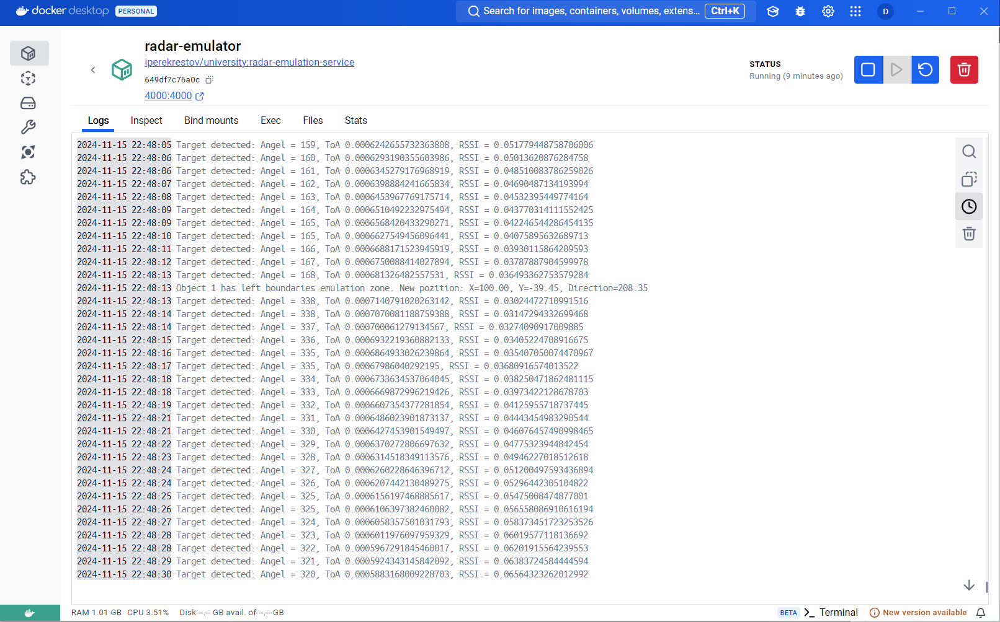
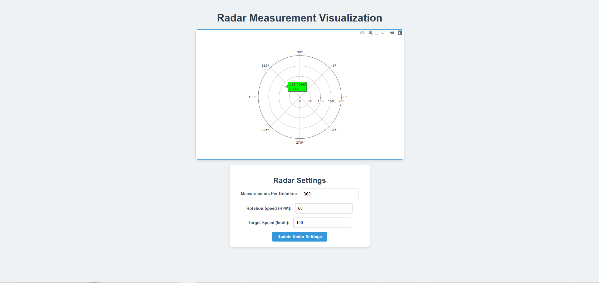

<h1>Лабораторна робота: Візуалізація даних радара з використанням Docker та WebSocket</h1>

Ця лабораторна робота спрямована на створення веб-додатку для візуалізації даних радара в реальному часі. Додаток підключається до емулятора радара через WebSocket, обробляє отримані дані та відображає їх на полярному графіку. Додатково реалізовано можливість налаштування параметрів радара через API

<strong>Крок 1: Встановлення Docker образу</strong>

Для запуску сервісу радара спочатку завантажимо необхідний Docker образ:

<pre><code>docker pull iperekrestov/university:radar-emulation-service</code></pre>

<strong>Крок 2: Запуск контейнера</strong>

Після завантаження Docker образу запустимо контейнер командою:

<pre><code>docker run --name radar-emulator -p 4000:4000 iperekrestov/university:radar-emulation-service</code></pre>

Це створить локальний сервер радара на порту 4000.

<strong>Крок 3: Підключення через WebSocket</strong>

Для отримання даних від радара підключімось до WebSocket сервера за допомогою клієнта <code>wscat</code>:

<pre><code>wscat -c ws://localhost:4000</code></pre>

<strong>Крок 4: Встановлення необхідних пакетів</strong>

Перейдемо до командного рядку та встановимо всі необхідні пакети для роботи з Websocket:

<pre><code>npm install</code></pre>

<strong>Крок 5: Запуск веб-додатку</strong>

Запустимо сервер веб-додатку командою:

<pre><code>node server.js</code></pre>

Після запуску серверу перевіряємо як дані надходять до клієнта в Docker (рис. 5):

  

<h2>Результат виконання</h2>

<strong>Рисунок 6: Візуалізація даних</strong>

Кінцевим результатом роботи є графік, що динамічно оновлюється на основі даних радара. Кожна точка на графіку позначає об'єкт, виявлений радаром. Колір і розмір точки відповідають силі сигналу:

  

<h2>Структура проекту</h2>

Основні файли проекту та їх призначення:

<ul>
  <li><strong>server.js</strong> – запускає сервер для обслуговування веб-сторінки та статичних файлів.</li>
  <li><strong>index.html</strong> – головна HTML сторінка додатку.</li>
  <li><strong>style.css</strong> – стилі для оформлення сторінки.</li>
  <li><strong>websocket_client.js</strong> – обробляє підключення до WebSocket сервера та отримання даних.</li>
  <li><strong>radar_display.js</strong> – відповідає за візуалізацію даних на графіку.</li>
  <li><strong>radar_config.js</strong> – надсилає запити на зміну параметрів радара через API.</li>
</ul>
